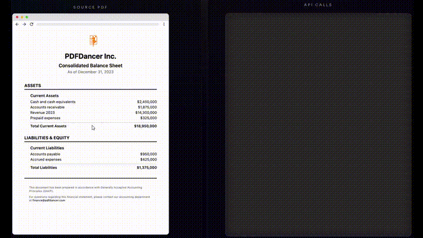

<div align="center">

# PDFDancer


</div>

**PDF used to be read-only. We fixed that.**

**Edit PDFs at a higher level: text, fonts, graphics - all preserved.**

**Pixel-perfect. No corruption. No fighting the format.**

Point at the paragraph you need, replace text, tweak fonts, modify vectors. No
templates, no overlays, no graphic designers in the loop.

PDFDancer treats PDFs like a real document format, not a printer target:

- Paragraphs and lines instead of glyph soup, so edits stay reflow-safe.
- A selector DSL shared across SDKs for text, fonts, regions, and semantic IDs.
- Direct access to vectors, images, and Form XObjects in code.
- Forms as first-class APIs for automation and audits.
- ML-driven font intelligence for missing or embedded fonts.

This repo is the developer landing page for the PDFDancer ecosystem.

- Product tour: [pdfdancer.com](https://www.pdfdancer.com?utm_source=github&utm_medium=readme&utm_campaign=pdfdancer)
- Docs + SDK surface: [
  `pdfdancer-api-docs`](https://github.com/MenschMachine/pdfdancer-api-docs) / [docs.pdfdancer.com](https://docs.pdfdancer.com?utm_source=github&utm_medium=readme&utm_campaign=pdfdancer)



🎥 Full walkthrough: watch the high-resolution demo at [pdfdancer.com/demo](https://www.pdfdancer.com/demo?utm_source=github&utm_medium=readme&utm_campaign=pdfdancer).

---

## Quick start

**Python:**

```python
from pdfdancer import PDFDancer

with PDFDancer.open(pdf_data="contract.pdf") as pdf:
    heading = pdf.page(0).select_paragraphs_starting_with("Total Amount:")[0]
    heading.edit().replace("$1,500").apply()
    pdf.save("updated.pdf")
```

**TypeScript:**

```typescript
const pdf = await PDFDancer.open('contract.pdf');
const heading = await pdf.page(0).selectParagraphsStartingWith('Total Amount:');
await heading[0].edit().replace('$1,500').apply();
await pdf.save('updated.pdf');
```

**Java:**

```java
PDFDancer pdf = PDFDancer.createSession("contract.pdf");
pdf.page(0).selectParagraphsStartingWith("Total Amount:").get(0)
    .edit().replace("$1,500").apply();
pdf.save("updated.pdf");
```

---

## Quick start using the pdfdancer mcp server

One command. Then start prompting your AI (Claude Code, Cursor, etc.) to edit real-world PDFs. That’s it.

Add PDFDancer to your AI coding assistant:

```shell
claude mcp add pdfdancer -- npx -y @pdfdancer/pdfdancer-mcp
```

OR

<a href="cursor://anysphere.cursor-deeplink/mcp/install?name=pdfdancer&config=eyJjb21tYW5kIjoibnB4IC15IEBwZGZkYW5jZXIvcGRmZGFuY2VyLW1jcCJ9" target="_blank" rel="noopener noreferrer">
    
</a>

OR

See all installation instructions at [pdfdancer.com/quickstart](https://www.pdfdancer.com/quick-start/?utm_source=github&utm_medium=readme&utm_campaign=pdfdancer#setup-guide).


---


## Examples

Checkout our example repositories for more code samples and use cases.

[](https://github.com/MenschMachine/pdfdancer-client-python-examples)

[](https://github.com/MenschMachine/pdfdancer-client-typescript-examples)

[](https://github.com/MenschMachine/pdfdancer-client-java-examples)


---

## Why backend developers love it

- **Stop begging for source files** – Edit text in real-world PDFs you didn’t create; PDFs are exposed as paragraphs,
  lines, glyphs, vectors, and forms for direct edits.
- **Selector DSL written for humans** – Target text via prefixes, regex, fonts, bounding boxes, or semantic IDs with
  the same DSL in every SDK.
- **Reflow-safe text and fonts** – Work at paragraph/line level instead of glyph soup so kerning, ligatures, and
  spacing stay intact when you edit.
- **Font intelligence built in** – ML-backed font matching, substitution, and upload helpers keep obscure or missing
  fonts editable without breaking layout.
- **Vector and asset control** – Inspect and tweak paths, strokes, fills, Form XObjects, and embedded images directly in
  code.
- **Forms as first-class APIs** – Enumerate, validate, fill, and reset AcroForm/XFA fields with before/after snapshots
  for audits.
- **Deploy on your terms** – Start in anonymous eval mode, then move to hosted API or self-hosted installs with auth
  scopes, retry knobs, and structured logs.

---

## How it compares to legacy libraries

| You expect…                                    | PDFDancer delivers                                                                                            | Traditional tools do…                                                                       |
|------------------------------------------------|---------------------------------------------------------------------------------------------------------------|---------------------------------------------------------------------------------------------|
| Edit text in real-world PDFs you didn’t create | Treats PDFs like a document format: exposes paragraphs, lines, glyphs, vectors, forms for direct edits        | Force layout rebuilds, page shuffles, or annotation overlays                                |
| Semantic selectors                             | Text/regex/font/bounding-box selectors shared across SDKs                                                     | Expose low-level operator streams; you track glyph runs manually                            |
| Layout-safe text & font edits                  | Paragraph-level reflow plus ML font recommendations keep spacing, kerning, ligatures, and custom fonts intact | Store text as disconnected glyphs, substitute fonts blindly, and break layout when you edit |
| Font intelligence                              | ML-powered matching/substitution plus managed uploads                                                         | Leave you to hunt down missing fonts manually                                               |
| Vector & asset control                         | Inspect/change paths, strokes, fills, Form XObjects, and embedded images                                      | Flatten vectors to bitmaps or punt to desktop design tools                                  |
| Form automation                                | Enumerate/fill/reset AcroForm & XFA with snapshots                                                            | Stop at basic checkbox filling; advanced logic still needs Acrobat                          |

---

## What developers ship with PDFDancer

- **Localization without layout drift** – Swap copy in multilingual brochures, contracts, or product sheets while
  paragraph shapes stay intact.
- **Compliance-safe edits** – Insert clauses, update rates, or delete sensitive text directly inside existing agreements
  and disclosures.
- **Financial & regulatory packets** – Normalize inbound statements, restyle disclaimers, and guarantee mandatory
  sections remain untouched.
- **Designer/agency handoffs** – Lock creative layouts, expose approved regions, and let scripts change prices, SKUs, or
  timelines safely.
- **Form-heavy workflows** – Enumerate, validate, fill, and reset AcroForm/XFA fields across applications, onboarding
  packs, or inspections.

---

## Technical details

- **SDKs:** Python 3.10+, TypeScript/Node.js 20+, Java 11+
- **Self-hosted:** Available for enterprise with custom endpoint configuration
- **Font Support:** Type1, TrueType, OpenType with ML-powered matching for subset restrictions

---

## Getting started

Skip straight to the [PDFDancer Getting Started guide](https://docs.pdfdancer.com?utm_source=github&utm_medium=readme&utm_campaign=pdfdancer) for SDK installation, auth, and
first-edit walkthroughs.

---

## Access & pricing

**Start Free. Scale When Ready.**

No signup. No API key. Just start coding. Upgrade removes watermarks.

- **Free** – Unlimited PDFs, unlimited API calls, all features. Exported PDFs carry a watermark so you can verify
  workflows safely.
- **Pro** – Everything in Free plus no watermarks and email support. Pricing
  at [pdfdancer.com/pricing](https://www.pdfdancer.com/?utm_source=github&utm_medium=readme&utm_campaign=pdfdancer#pricing).
- **Enterprise** – Everything in Pro plus self-hosting/on-premise licensing, dedicated support, and onboarding. Contact
  options at [pdfdancer.com/pricing](https://www.pdfdancer.com/?utm_source=github&utm_medium=readme&utm_campaign=pdfdancer#pricing).

---

## Where to go next

- **Complete API docs** – [`pdfdancer-api-docs`](https://docs.pdfdancer.com?utm_source=github&utm_medium=readme&utm_campaign=pdfdancer) houses the SDK references, guides, and the
  Getting Started walkthrough.
- **Blog** – [pdfdancer.com/blog](https://www.pdfdancer.com/blog/?utm_source=github&utm_medium=readme&utm_campaign=pdfdancer) covers deep dives, release notes, and customer
  workflows.
- **Changelog** – [pdfdancer.com/changelog](https://www.pdfdancer.com/changelog/?utm_source=github&utm_medium=readme&utm_campaign=pdfdancer) tracks what's new.
- **Status & incidents** – [status.pdfdancer.com](https://status.pdfdancer.com) for uptime and incident reports.
- **Roadmap** – Follow along at [docs.pdfdancer.com/roadmap](https://docs.pdfdancer.com/roadmap/?utm_source=github&utm_medium=readme&utm_campaign=pdfdancer) for upcoming
  milestones.
- **Talk with us** – Ping your success channel or email `support@pdfdancer.com` for onboarding, roadmap input, or
  self-hosted deployments.

---

## FAQ

Common questions about PDFDancer's capabilities and limitations: [pdfdancer.com/#faq](https://www.pdfdancer.com/?utm_source=github&utm_medium=readme&utm_campaign=pdfdancer#faq)

---

## Open-source ecosystem

- `pdfdancer-api-docs` – Unified SDK/API docs rendered with Docusaurus and deployed to GitHub
  Pages. [MenschMachine/pdfdancer-api-docs](https://github.com/MenschMachine/pdfdancer-api-docs)
- `pdfdancer-client-java`  – JVM SDK exposing fluent selectors,
  validation, and exports for servers or
  desktops. [MenschMachine/pdfdancer-client-java](https://github.com/MenschMachine/pdfdancer-client-java)
- `pdfdancer-client-python`  – Python 3.10+ SDK mirroring the
  object model, context managers, and structured
  exceptions. [MenschMachine/pdfdancer-client-python](https://github.com/MenschMachine/pdfdancer-client-python)
- `pdfdancer-client-typescript`  – TypeScript SDK for Node.js and
  browsers with retry/timeout controls, streaming helpers, and ergonomic
  builders. [MenschMachine/pdfdancer-client-typescript](https://github.com/MenschMachine/pdfdancer-client-typescript)
- `pdfdancer-mcp`  – Model Context Protocol server connecting
  PDFDancer to AI coding assistants like Claude Code and
  Cursor. [MenschMachine/pdfdancer-mcp](https://github.com/MenschMachine/pdfdancer-mcp)

---

## All PDFDancer repositories

| Repository                                                                                                      | Visibility | Purpose                                                                      |
|-----------------------------------------------------------------------------------------------------------------|------------|------------------------------------------------------------------------------|
| [`changelog`](https://github.com/MenschMachine/changelog)                                                       | Public     | Generates weekly changelogs for the PDFDancer stack from linked repositories |
| [`font-identifier`](https://github.com/MenschMachine/font-identifier)                                           | Private    | AI-powered font recognition using deep learning to identify fonts in images  |
| [`fonts`](https://github.com/MenschMachine/pdf-engine-fonts)                                                    | Private    | Font collection and management for PDF processing                            |
| [`pdfdancer`](https://github.com/MenschMachine/pdfdancer)                                                       | Public     | Main developer landing page and ecosystem overview                           |
| [`pdfdancer-api`](https://github.com/MenschMachine/pdfdancer-api)                                               | Private    | Micronaut REST API providing PDF processing capabilities via HTTP endpoints  |
| [`pdfdancer-api-docs`](https://github.com/MenschMachine/pdfdancer-api-docs)                                     | Public     | Unified documentation site built with Docusaurus for all SDKs                |
| [`pdfdancer-api-runtime`](https://github.com/MenschMachine/pdfdancer-api-runtime)                               | Private    | Runtime environment and deployment configuration for the API                 |
| [`pdfdancer-backend`](https://github.com/MenschMachine/pdfdancer-backend)                                       | Private    | Core PDF engine for analysis and extraction                                  |
| [`pdfdancer-client-java`](https://github.com/MenschMachine/pdfdancer-client-java)                               | Public     | Official Java SDK with fluent API for PDF manipulation                       |
| [`pdfdancer-client-java-examples`](https://github.com/MenschMachine/pdfdancer-client-java-examples)             | Public     | Working Java code examples demonstrating SDK usage patterns                  |
| [`pdfdancer-client-python`](https://github.com/MenschMachine/pdfdancer-client-python)                           | Public     | Official Python SDK with context managers and structured exceptions          |
| [`pdfdancer-client-python-examples`](https://github.com/MenschMachine/pdfdancer-client-python-examples)         | Public     | Bite-sized Python recipes for common PDF workflows                           |
| [`pdfdancer-client-typescript`](https://github.com/MenschMachine/pdfdancer-client-typescript)                   | Public     | Official TypeScript SDK for Node.js and browsers                             |
| [`pdfdancer-client-typescript-examples`](https://github.com/MenschMachine/pdfdancer-client-typescript-examples) | Public     | TypeScript code examples mirroring Python cookbook patterns                  |
| [`pdfdancer-frontend`](https://github.com/MenschMachine/pdfdancer-frontend)                                     | Private    | Web-based frontend application for PDF editing                               |
| [`pdfdancer-mcp`](https://github.com/MenschMachine/pdfdancer-mcp)                                               | Public     | Model Context Protocol server connecting PDFDancer to AI coding assistants   |
| [`pdfdancer-tools`](https://github.com/MenschMachine/pdfdancer-tools)                                           | Private    | Internal tooling and utilities for development and testing                   |
| [`pdfdancer-www`](https://github.com/MenschMachine/pdfdancer-www)                                               | Private    | Marketing website built with Gatsby, React, and TypeScript                   |
